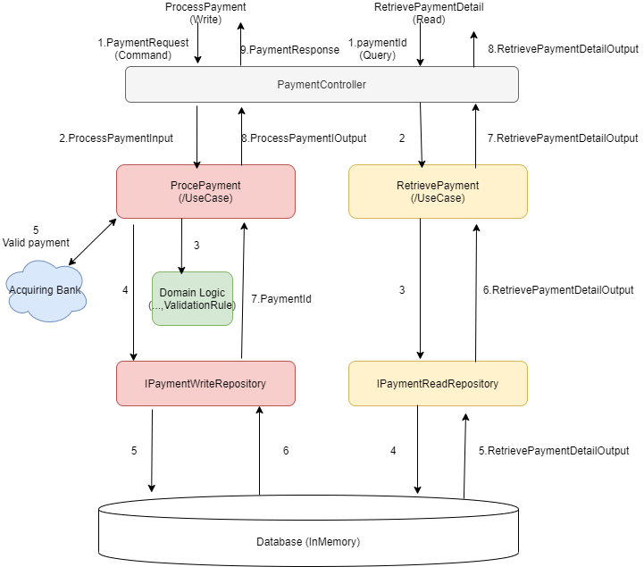

### .Net Challenge - Simple Card Payment

## Required
- ASP.NET Core 3.1

## Endpoints
### Process Payment

Method: POST

URI: /api/v1.0/payment

Assumption : 

-Unsuccessful card_number: 4111111111111111

-Only accept Visa card,  RegexValidation : ^4[0-9]{12}(?:[0-9]{3})?$ (ref https://www.regular-expressions.info/creditcard.html)

### Retrieve Payment detail

Method: GET

URI: /api/v1.0/payment/{paymentId}

## Monitoring
- HealthCheck : {baseUrl}/health
- Metrics : {baseUrl}/metrics

## Architecture
- Onion Architecture

- Diagram Flow - CQRS

